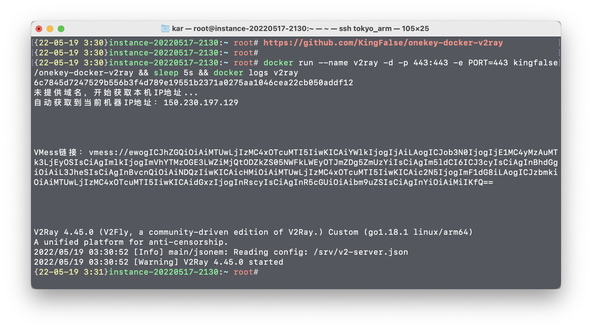

# onekey-docker-v2ray

**一键部署你的V2ray服务**

### 快速安装
* 首先ssh登陆你的VPS主机并切换到root用户安装Docker,官方一键安装脚本:`curl -sSL https://get.docker.com/ | sh`或者`curl -sSL https://get.docker.com/ | bash`

* 设置docker开机启动：`systemctl enable docker.service && systemctl enable containerd.service`

* 然后执行`docker run --name v2ray -d --restart=always -p 443:443 -e PORT=443 kingfalse/onekey-docker-v2ray && sleep 5s && docker logs v2ray` 即可安装完成,并输出VMess链接

* 因为是自签证书,必须在客户端中将`跳过证书验证(allowInsecure)`选项设置为true

* 如果你想用其他端口也可以,但请务必确认你的防火墙,安全组啥的都打开了,然后直接`docker run --name v2ray -d --restart=always -p 5000:5000 -e PORT=5000 kingfalse/onekey-docker-v2ray && sleep 5s && docker logs v2ray` 

### 完全卸载
```
docker stop v2ray
docker rm v2ray
```

### 屏幕预览


### 其他
有问题提Issues,有需求也可
